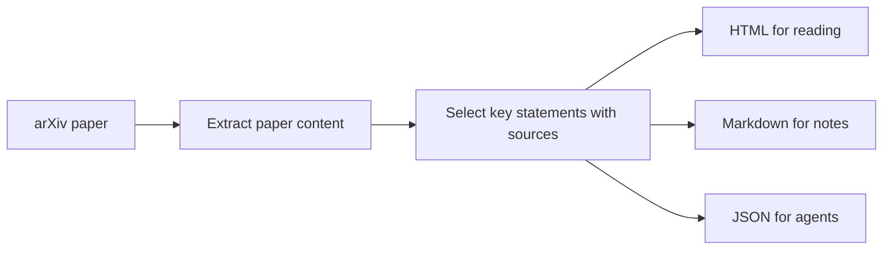

# RPL — Research Paper Layer

RPL turns an arXiv paper into a short learning package for people and AI agents.

Give RPL an arXiv URL or ID. It creates:

- `paper.html` — a readable, responsive page with key ideas, evidence, limitations, and a sourced visual or paper outline
- `paper.md` — a learning card in Markdown
- `paper.json` — structured content with source information for AI agents and other tools

RPL runs on your computer. It does not require an account, API key, or AI model. Processing an arXiv URL requires internet access; saved arXiv HTML files can be processed offline.

## Quick start

You need Python 3.11 or newer.

```bash
git clone https://github.com/emilsmeznieks/RPL.git
cd RPL
python3 -m venv .venv
source .venv/bin/activate
python -m pip install .
```

On Windows PowerShell, use `.venv\Scripts\Activate.ps1` instead of `source .venv/bin/activate`.

RPL is not tied to the paper used in our tests. Process another arXiv paper by replacing `YOUR_ARXIV_ID` with its ID:

```bash
rpl learn https://arxiv.org/html/YOUR_ARXIV_ID
```

The files are saved here:

```text
rpl-output/YOUR_ARXIV_ID/
├── paper.html
├── paper.md
└── paper.json
```

Open `paper.html` in any browser to read the result.

## Use RPL from a local AI client

Install the optional MCP support from the cloned repository:

```bash
python -m pip install -e ".[mcp]"
```

MCP configuration differs by client. The example below uses the common `mcpServers` JSON format on macOS and Linux. Check your client's MCP documentation for its configuration file and supported format.

```json
{
  "mcpServers": {
    "rpl": {
      "command": "/ABSOLUTE/PATH/TO/RPL/.venv/bin/rpl",
      "args": ["mcp"]
    }
  }
}
```

Replace the command with the real path to `rpl` inside your virtual environment. On Windows, the executable is normally under `.venv\Scripts\rpl.exe`.

Restart the AI client, then ask:

```text
Use RPL to analyze this arXiv paper: YOUR_ARXIV_URL
```

The AI client can call `analyze_arxiv_paper`. RPL saves `paper.html`, `paper.md`, and `paper.json` under `~/RPL/` by default. To change that folder, set `args` to `["mcp", "--output", "/ABSOLUTE/PATH/TO/LIBRARY"]`. The MCP tool accepts arXiv URLs and IDs; it cannot read arbitrary local files.

## Other ways to run RPL

Use the paper's arXiv ID instead of a full URL:

```bash
rpl learn YOUR_ARXIV_ID
```

RPL also accepts arXiv abstract and PDF links. It automatically uses the paper's HTML version for extraction, which must be available on arXiv.

Older arXiv IDs are supported too:

```bash
rpl learn hep-th/9901001
```

The Agentic ERP paper is the current development test example:

```bash
rpl learn https://arxiv.org/html/2607.17331v1
```

Choose a different output folder:

```bash
rpl learn YOUR_ARXIV_ID --output ./my-library
```

Create only one file type:

```bash
rpl learn YOUR_ARXIV_ID --format html
rpl learn YOUR_ARXIV_ID --format markdown
rpl learn YOUR_ARXIV_ID --format json
```

Print Markdown or JSON in the terminal:

```bash
rpl learn YOUR_ARXIV_ID --format markdown --stdout
rpl learn YOUR_ARXIV_ID --format json --stdout
```

Process a saved arXiv HTML file:

```bash
rpl learn ./paper.html
```

## What RPL extracts

- The research problem
- The paper's main idea
- Evidence worth checking
- Limitations
- Key takeaways
- Paper sections, equations, and figure captions in the structured JSON
- A visual model of an architecture or process when the paper states one clearly

Every selected statement includes its source section and exact paragraph when arXiv provides one. Every visual node also keeps the exact text that supports it.

If RPL cannot identify an architecture or process safely, it shows the paper structure instead and marks the visual as low confidence.

The HTML visual includes Play, Pause, Previous, and Next controls. Automatic playback starts only when you select Play. Reduced-motion settings remove animated transitions, but the step controls still work.

## Clarity and grounding rules

- RPL does not use an AI model to rewrite or invent paper claims.
- RPL adds labels, paper classifications, confidence levels, and visual structure. These are RPL-created structure, not paper quotations.
- Results are labeled as results reported by the paper, not as proven facts.
- Reader views remove citation-number clutter but do not replace the paper's words.
- Acronym expansions are included only when the paper states them directly.
- Sources link to the exact paragraph in arXiv when available, otherwise to the section.

RPL does not independently verify the paper's results. Always check important claims in the original paper.

## Using the output with an AI agent

Use `paper.json` as input for a local agent, script, or research library. It contains the paper data, extracted learning card, visual model, comparison data, and source information.

The top-level JSON fields are:

- `schema_version` — the RPL output schema version
- `paper` — paper metadata, abstract, sections, equations, and figure captions
- `digest` — selected problem, core idea, results, limitations, and takeaways
- `visual` — sourced nodes and connections for the HTML visual
- `glossary` — acronym expansions stated by the paper
- `comparison` — related-paper data or an explicit `not-generated` status
- `provenance` — source and extraction information

The comparison model separates:

- `related_papers` — paper identity and source metadata
- `relation_signals` — why papers are related, with exact evidence from each paper
- `dimensions` — sourced side-by-side values such as problem, method, dataset, or result

Supported relationship types are `same-topic`, `shared-task`, `shared-method`, `shared-equation`, `shared-dataset`, `cites`, and `cited-by`.

Similarity relationships require evidence from both papers. Until automatic discovery runs, the status remains `not-generated`; RPL does not return an empty list as if it had searched and found nothing.

Compatible AI clients can use this data through RPL's local MCP server. Automatic related-paper discovery is not implemented yet.

## How it works



RPL currently copies relevant statements from the paper instead of generating a new summary with an AI model. This reduces invented claims, but it can still miss important information or select an unhelpful sentence.

## Current limits

- Online input requires internet access and an arXiv HTML version of the paper.
- A PDF URL is accepted as an identifier, but RPL reads the matching arXiv HTML page. It does not parse the PDF.
- The selection rules are designed primarily for English-language papers.
- RPL can miss important content or select weak, repeated, or conflicting statements. It does not reconcile contradictions in a paper.
- Equations and figure captions are preserved in `paper.json`; the short HTML and Markdown views do not show all of them.
- Visual extraction is limited to clear process sequences and specific architecture-caption patterns. Other papers receive a low-confidence section outline.
- Related-paper discovery and comparison are not implemented yet.

## Current status

RPL 0.7 supports:

- Modern and legacy arXiv URLs and IDs
- Saved arXiv HTML files
- Standalone HTML, Markdown, and JSON output
- System-native HTML styling with light, dark, and increased-contrast modes
- Architecture extraction from figure captions
- Process extraction from clear step sequences
- Safe fallback to a paper-section visual
- Play, pause, and step controls for visual explanations
- Paper-defined acronym expansions
- Direct links to matching arXiv paragraphs or sections
- One selected statement per exact source paragraph in each output section
- Paper-type-aware result extraction for empirical and theoretical papers
- An evidence-backed JSON model for future related-paper comparisons
- A local MCP server for compatible AI clients
- One reusable analysis service shared by the CLI and MCP server
- Cleaner reader text without citation-number clutter

Not yet included:

- AI-written explanations
- Automatic discovery and comparison of related papers
- A saved research library

## Roadmap

1. Find related papers and populate evidence-backed comparisons.
2. Add related-paper maps to the HTML and MCP output.
3. Build local saved research libraries.
4. Add optional cited AI explanations.

## Development

Install the project and local MCP test dependency in editable mode:

```bash
python -m pip install -e ".[mcp]"
```

Run the tests:

```bash
python -m unittest discover -s tests -v
```

Run a dependency security audit:

```bash
python -m pip install -e ".[mcp,security]"
python -m pip_audit --skip-editable
```

## Security

Do not report vulnerabilities in a public issue. Follow the private reporting steps in [SECURITY.md](SECURITY.md).

## Contributing

Issues and pull requests are welcome. For a large change, please open an issue first so we can agree on the direction.

## License

[MIT](LICENSE)
