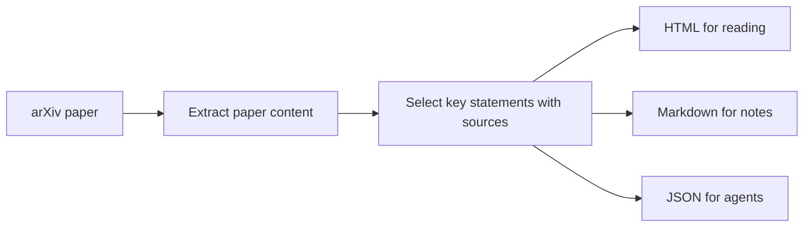

# RPL — Research Paper Layer

RPL turns an arXiv paper into a short learning package for people and AI agents.

Give RPL an arXiv URL or ID. It creates:

- `paper.html` — a readable page with key ideas, evidence, limitations, and an interactive visual explanation
- `paper.md` — a learning card in Markdown
- `paper.json` — structured content with source information for AI agents and other tools

RPL runs locally. It does not require an account, API key, or AI model.

## Quick start

You need Python 3.11 or newer.

```bash
git clone https://github.com/emilsmeznieks/RPL.git
cd RPL
python3 -m venv .venv
source .venv/bin/activate
python -m pip install .
```

Process a paper:

```bash
rpl learn https://arxiv.org/html/2607.17331v1
```

The files are saved here:

```text
rpl-output/2607.17331v1/
├── paper.html
├── paper.md
└── paper.json
```

Open `paper.html` in any browser to read the result.

## Other ways to run RPL

Use an arXiv ID instead of a full URL:

```bash
rpl learn 2607.17331v1
```

Choose a different output folder:

```bash
rpl learn 2607.17331v1 --output ./my-library
```

Create only one file type:

```bash
rpl learn 2607.17331v1 --format html
rpl learn 2607.17331v1 --format markdown
rpl learn 2607.17331v1 --format json
```

Print Markdown or JSON in the terminal:

```bash
rpl learn 2607.17331v1 --format markdown --stdout
rpl learn 2607.17331v1 --format json --stdout
```

Process a saved arXiv HTML file:

```bash
rpl learn ./paper.html
```

## What RPL extracts

- The research problem
- The paper's main idea
- Evidence worth checking
- Limitations
- Key takeaways
- Paper sections, equations, and figure captions
- A visual model of an architecture or process when the paper states one clearly

Every selected statement includes its source section and exact paragraph when arXiv provides one. Every visual node also keeps the exact text that supports it.

If RPL cannot identify an architecture or process safely, it shows the paper structure instead and marks the visual as low confidence.

The HTML visual includes Play, Pause, Previous, and Next controls. Motion starts only when you select Play and is disabled when your device requests reduced motion.

## Clarity and grounding rules

- RPL does not add claims that are absent from the paper.
- Results are labeled as results reported by the paper, not as proven facts.
- Reader views remove citation-number clutter but do not replace the paper's words.
- Technical terms are explained only when the paper defines them.
- Sources link to the exact paragraph in arXiv when available, otherwise to the section.

RPL does not independently verify the paper's results. Always check important claims in the original paper.

## Using the output with an AI agent

Use `paper.json` as input for a local agent, script, or research library. It contains the paper data, extracted learning card, visual model, and source information.

Example:

```json
{
  "schema_version": "0.4",
  "digest": {
    "problem": {
      "text": "A statement selected from the paper...",
      "section": "Abstract",
      "source_anchor": null
    },
    "evidence": [],
    "limitations": []
  },
  "visual": {
    "schema_version": "0.1",
    "visual_type": "layered-architecture",
    "confidence": "medium",
    "nodes": [],
    "edges": []
  },
  "glossary": [],
  "provenance": {
    "generated_claims": false
  }
}
```

Direct connections for Claude, ChatGPT, Codex, and other agents are planned after the local tool is stable.

## How it works



RPL currently copies relevant statements from the paper instead of generating a new summary with an AI model. This reduces invented claims, but it can still miss important information or select an unhelpful sentence.

Always check important claims in the original paper.

## Current status

RPL 0.5 supports:

- arXiv HTML URLs and IDs
- Saved arXiv HTML files
- Standalone HTML, Markdown, and JSON output
- Architecture extraction from figure captions
- Process extraction from clear step sequences
- Safe fallback to a paper-section visual
- Play, pause, and step controls for visual explanations
- Paper-defined terminology
- Direct links to matching arXiv paragraphs or sections
- Cleaner reader text without citation-number clutter

Not yet included:

- AI-written explanations
- Comparisons with related papers
- A saved research library
- Agent connections through Model Context Protocol (MCP)

## Roadmap

1. Add cited AI explanations.
2. Compare related papers.
3. Build local research libraries.
4. Add MCP tools for AI agents.

## Development

Install the project in editable mode:

```bash
python -m pip install -e .
```

Run the tests:

```bash
python -m unittest discover -s tests -v
```

## Contributing

Issues and pull requests are welcome. For a large change, please open an issue first so we can agree on the direction.

## License

[MIT](LICENSE)
