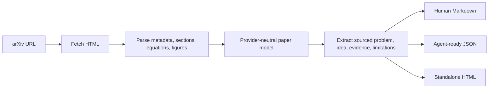

# RPL — Research Paper Layer

RPL turns research papers into the small set of ideas, evidence, and limitations that humans and AI agents need.

The current version is a local CLI. Give it an arXiv URL and it creates:

- `paper.md` — a focused learning card with a visual Mermaid paper map
- `paper.json` — structured paper content and sourced statements for software or agents
- `paper.html` — a polished, self-contained learning card that opens in any browser

RPL is deliberately **extractive** today: it selects statements from the paper instead of asking an LLM to invent a summary. Model-powered explanations and paper comparisons come next; MCP comes after the core is reliable.

## Quick start

Requires Python 3.11 or newer.

```bash
git clone https://github.com/emilsmeznieks/RPL.git
cd RPL
python3 -m venv .venv
source .venv/bin/activate
pip install -e .
```

Process the first test paper:

```bash
rpl learn https://arxiv.org/html/2607.17331v1
```

RPL writes:

```text
rpl-output/2607.17331v1/
├── paper.md
├── paper.json
└── paper.html
```

Print one format directly in the terminal:

```bash
rpl learn 2607.17331v1 --format markdown --stdout
rpl learn 2607.17331v1 --format json --stdout
rpl learn 2607.17331v1 --format html --output ./my-library
```

Local arXiv HTML files also work:

```bash
rpl learn ./paper.html --output ./my-library
```

## How it works



Every selected statement includes its source section. The JSON also records the extraction method and whether generated claims are present.

## Example agent payload

```json
{
  "schema_version": "0.1",
  "digest": {
    "problem": {
      "text": "A statement selected from the paper...",
      "section": "Abstract"
    },
    "evidence": [],
    "limitations": [],
    "extraction_method": "deterministic-extractive-v1"
  },
  "provenance": {
    "generated_claims": false
  }
}
```

## Current scope

- arXiv HTML URLs, arXiv IDs, and local HTML files
- Metadata, abstract, section, equation, and figure-caption extraction
- Conservative evidence and limitation selection
- Markdown, JSON, and standalone HTML output
- No API key and no required model provider

The deterministic selector is intentionally simple. It can miss important ideas, and its output must not be treated as an expert review.

## Roadmap

1. Add paper-specific animated visual explanations to the HTML output.
2. Add grounded model-powered explanations with citations.
3. Compare related papers and show meaningful differences.
4. Create reusable local research libraries.
5. Expose the stable core through MCP for Claude, ChatGPT, Codex, and other agents.

## Development

Run the test suite:

```bash
python -m unittest discover -s tests -v
```

## Contributing

Issues and pull requests are welcome. Please open an issue before a large change so we can align on the product direction.

## License

[MIT](LICENSE)
